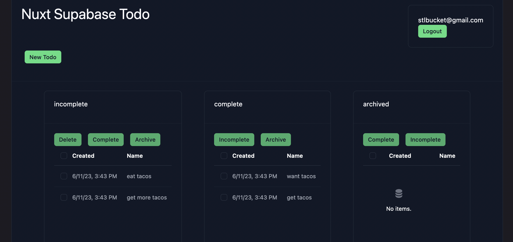

# nuxt3-supabase-todo
### Useful links
- [Nuxt3 Docs](https://nuxt.com/docs)
- [Supabase Docs](https://supabase.com/docs)
- [NuxtLabs UI Docs](https://ui.nuxtlabs.com/getting-started)

### Getting started
- clone this repository and ```npm install```
- create a supabase project called ***todo*** (name not important)
- run [build-todo-app.sql](./sql-scripts/build-todo-app.sql) in the supabase SQL editor
- copy **.env.example** to **.env** and populate accordingly
- ```npm run dev```


